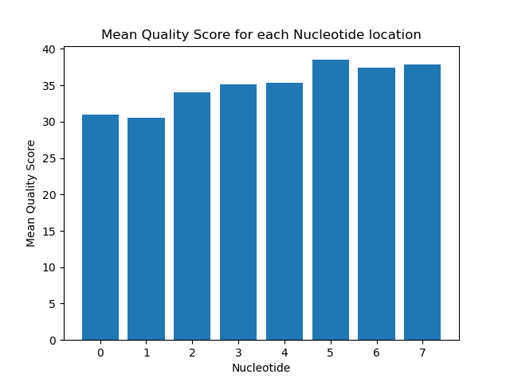

# Assignment the First

## Part 1
1. Be sure to upload your Python script. Provide a link to it here:

| File name | label | Read length | Phred encoding |
|---|---|---|---|
| 1294_S1_L008_R1_001.fastq.gz | read1 | 101 | Phred+33 |
| 1294_S1_L008_R2_001.fastq.gz | index1 | 8 | Phred+33 |
| 1294_S1_L008_R3_001.fastq.gz | index2 | 8 | Phred+33 |
| 1294_S1_L008_R4_001.fastq.gz | read2 | 101 | Phred+33 |

2. Per-base NT distribution
    1. 
     
     
     
    2. For biological read pairs, a good cutoff is a quality score of 25. For index reads a good cutoff is also a quality score of 25. This cutoff will get rid of the quality scores that we know are incorrect, but will include most of the natural variation in quality score. When looking at my graphs, the there were no values lower than 30; however, since the data depicts means, there may be small amounts of quality scores lower than that value. So, a quality score cutoff of 25 should get rid of only the outliers. 
    3. 
        1. R2 indexes with "N": 3976613
        2. R3 indexes with "N": 3328051

    
## Part 2
1. Define the problem:
```The problem is that we need to de-multiplex the sequencing outputs. We will have to figure out whether the indexes are dual-matched, hopped, or unknown.```
2. Describe output:
```The output is 48 fastq files with modified headers that include the dual-matched headers. We will also have two files where the headers contain unkown indexes. Finally, we will have have two files that contain headers with the index-hopped indexes. So in total, there will be 52 fastq files. ```
3. Upload your [4 input FASTQ files](../TEST-input_FASTQ/) and your [>=6 expected output FASTQ files](../TEST-output_FASTQ/).
4. 
```
import argparse
def(reverse_complement, )
    '''This function takes a string of DNA and uses a dictionary to determine its reverse complement sequence. For example, it will take "ACTG" and turn it into "CAGT".  '''
    dictDNA = dict()
    #key = nucleotide
    #value = corresponding compliment nucleotide
    #EX: {A:T, T:A, G:C, C:G, N:N}
    RVcomp = ""
    for base in DNA:
        Go through each base and reverse compliment

    return(reverseCompliment)
with open(all 4 files, "r") as ____, open(all files to write to, "w") as write files:
    while true: 
        readline
        readline

        call reverse compliment function()
        if "N" present OR index not one of known indexes, send to unkown file
        elif Fwindex == RVindex, send to matching index-pair file
        elif Fwindex != RVindex AND one of known indexes, send to index-hopped fastq file

```


5. High level functions. For each function, be sure to include:
    1. Description/doc string
    2. Function headers (name and parameters)
    3. Test examples for individual functions
    4. Return statement
